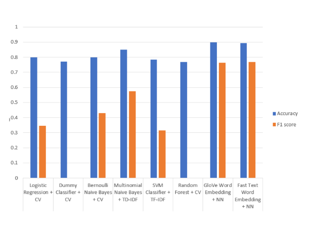

# Unintended Bias in Toxicity Classification

Here in this proejct, i haev trained a model to predict toxicity in an a comment. Dataset are part of kaggle cometion Jigsaw Unintended Bias in Toxicity Classification. 

The Model was built by performing feature engineering like count of capitalization in a sentence , number of unique words, number of question/exclamation mark and some more. Also data cleaning was performed like lowercasing, tokenizing, lemmatizing , mapping contractions, stop words removal, special character removal .

Initially i created models with count and TF-IDF vectors and later i used GloVe and FAst Text Word vectors with sklearn and neural network respectivly. below are thir relative scores:

